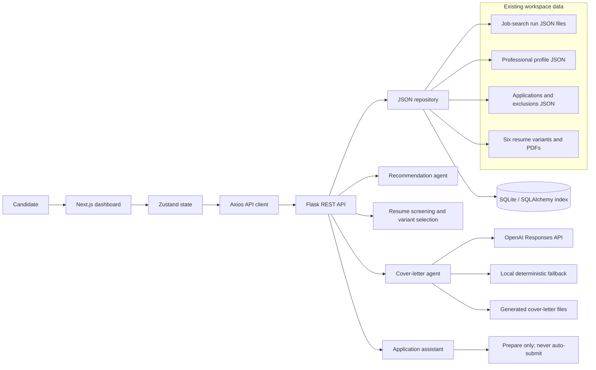

# Role Radar architecture

## Responsibility boundaries

- The Next.js frontend presents the shortlist, composes filters, and sends explicit user actions to the API.
- The Flask API owns data normalization, durable status changes, cover-letter generation, and access to candidate profile data.
- Existing JSON files remain the portable source of truth. SQLAlchemy builds a queryable local index without replacing them.
- The recommendation and resume-screening layers use verified scores and resume variants already present in the run data.
- Automated application submission is intentionally outside the system boundary. The application assistant may prepare materials, but never submits on the candidate's behalf.

