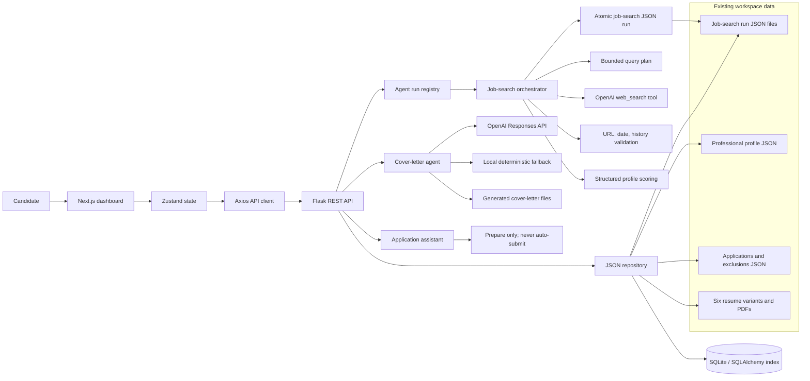

# Role Radar architecture

## Responsibility boundaries

- The Next.js frontend presents the shortlist, composes filters, and sends explicit user actions to the API.
- The Flask API owns data normalization, durable status changes, cover-letter generation, and access to candidate profile data.
- Existing JSON files remain the portable source of truth. SQLAlchemy builds a queryable local index without replacing them.
- The job-search orchestrator makes research calls through the OpenAI Responses
  API, but ordinary Python code owns query limits, history exclusion, URL/date
  validation, score normalization, resume allowlisting, and persistence.
- Every agent phase is recorded in an in-process run registry and exposed to the
  frontend. This makes the execution trace inspectable without exposing hidden
  reasoning.
- Automated application submission is intentionally outside the system boundary. The application assistant may prepare materials, but never submits on the candidate's behalf.
