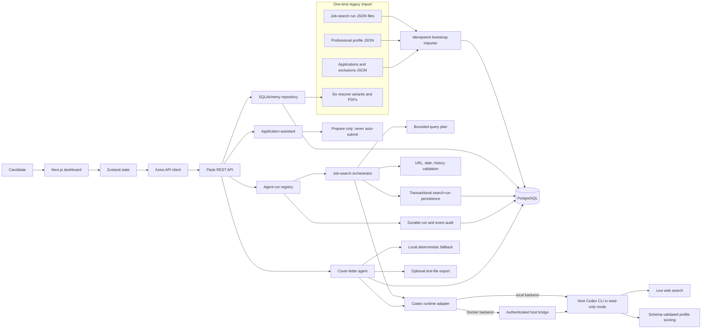

# Role Radar architecture

## Responsibility boundaries

- The Next.js frontend presents the shortlist, composes filters, and sends explicit user actions to the API.
- The Flask API owns data normalization, durable status changes, cover-letter generation, and access to candidate profile data.
- PostgreSQL is the authoritative store for all dynamic application data.
  Existing workspace JSON files are a one-time bootstrap source when their
  destination tables are empty.
- Search runs and their ranked listings are modeled separately, preserving a
  job's history across multiple runs while keeping one canonical job record.
- The job-search and cover-letter agents invoke the signed-in host Codex CLI
  through `codex exec`. Prompts travel over stdin and final results are
  constrained by generated Pydantic JSON Schemas. Neither workflow reads an
  OpenAI API key.
- When Flask runs in Docker, its runtime adapter sends only the prompt, output
  schema, and search flag to an authenticated bridge on the host. The bridge
  does not accept arbitrary commands, paths, or sandbox settings.
- Codex runs with a read-only sandbox through either direct CLI mode or the
  host bridge. Ordinary Python code still owns query limits, history exclusion,
  URL/date validation, score normalization, resume allowlisting, and
  persistence.
- Every agent phase is persisted to PostgreSQL and exposed to the frontend.
  Interrupted runs are marked failed after a backend restart, keeping the
  execution trace inspectable without exposing hidden reasoning.
- Automated application submission is intentionally outside the system boundary. The application assistant may prepare materials, but never submits on the candidate's behalf.
