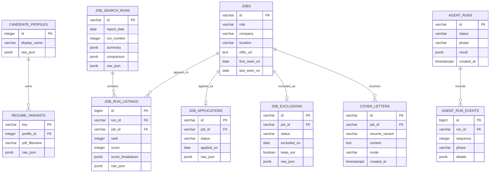

# PostgreSQL data model

PostgreSQL is Role Radar's source of truth for dynamic data. SQLAlchemy models
live in `backend/models.py`; the equivalent PostgreSQL bootstrap DDL is in
`backend/schema.sql`.

## Modeling choices

- `jobs` stores the canonical role identity and current stable fields.
- `job_search_runs` stores report-level summaries, comparisons, issues, and
  agent metadata.
- `job_run_listings` is the historical many-to-many edge between jobs and
  search runs. Its unique `(run_id, job_id)` constraint prevents duplicates in
  one run while preserving rank and score changes over time.
- Applications and exclusions allow at most one active record per job through
  a unique `job_id` constraint.
- JSONB retains source-specific evidence without sacrificing normalized keys,
  relationships, dates, or indexes used by the application.
- Cover-letter content and agent events are durable; generated text files are
  exports, not the source of truth.

## Bootstrap behavior

On an empty database, the backend imports the candidate profile, resume
variants, every historical search run, applications, and exclusions from the
workspace JSON files. Each domain is imported only when its destination table
is empty, so restarting containers cannot overwrite newer PostgreSQL data.
